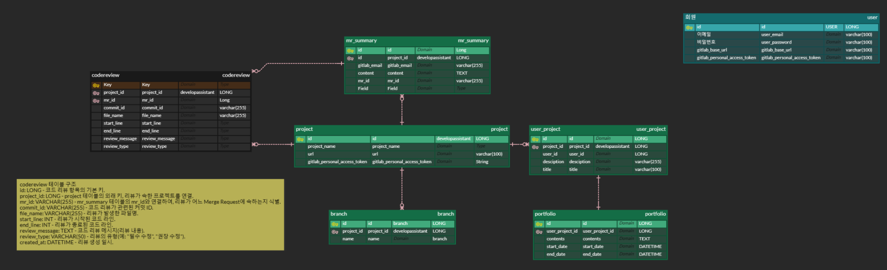
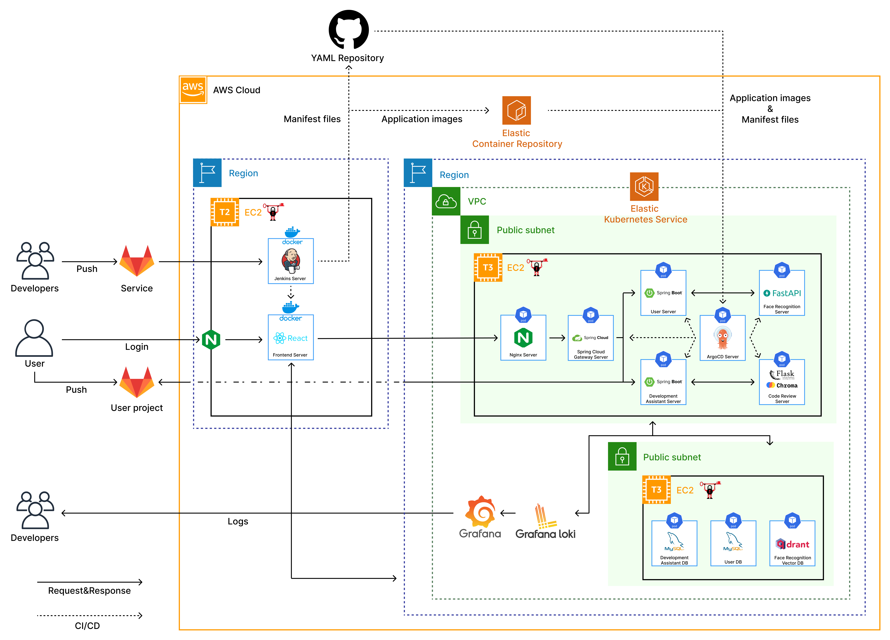
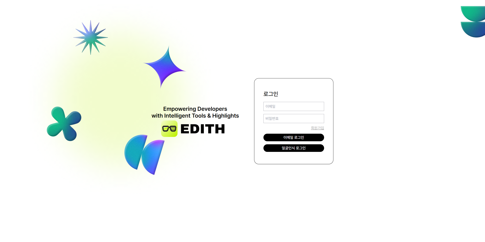
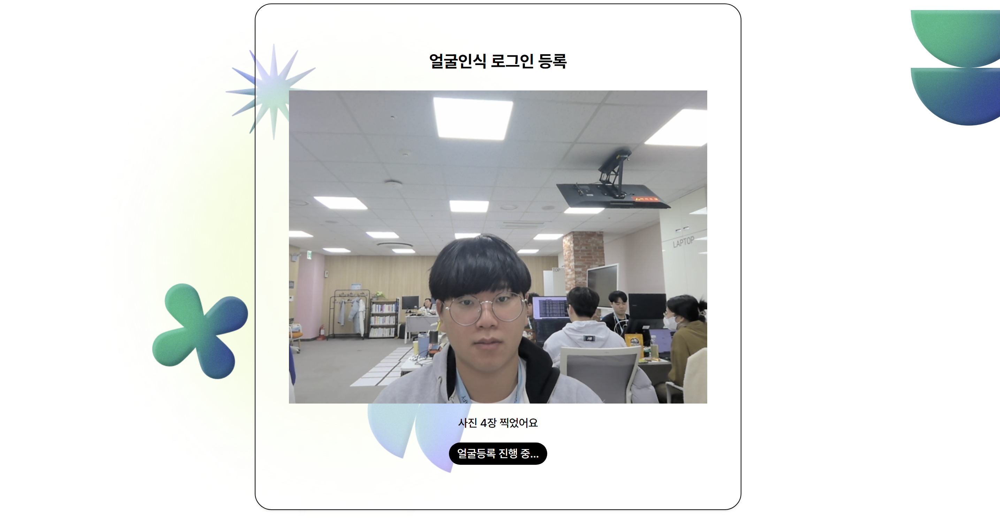
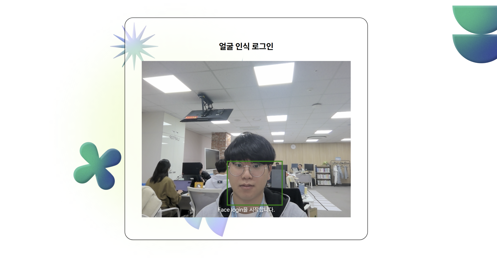
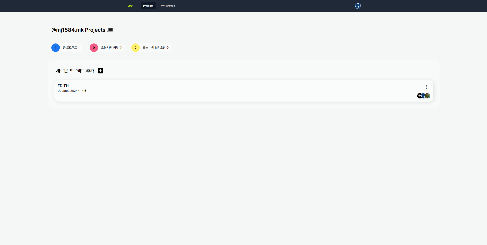
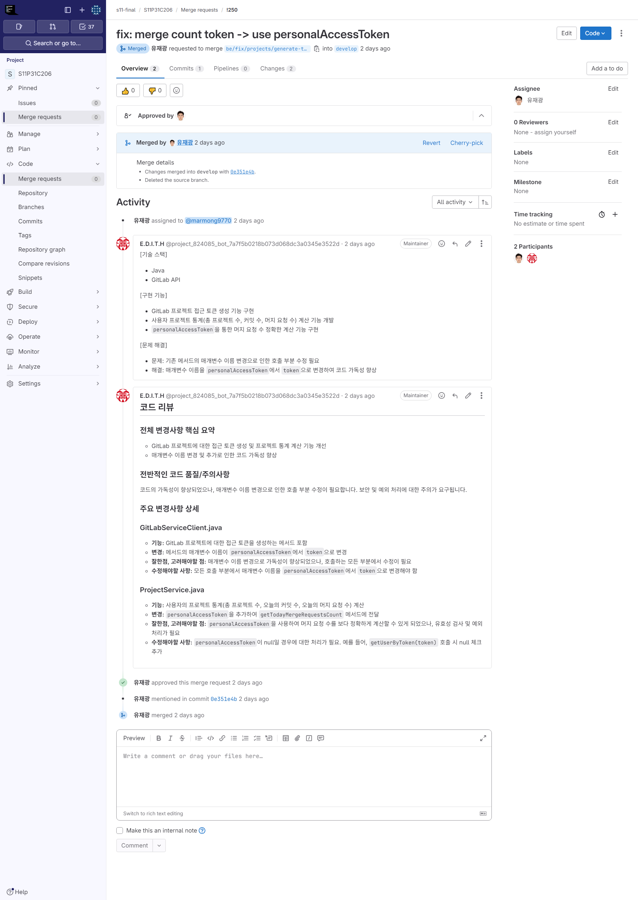
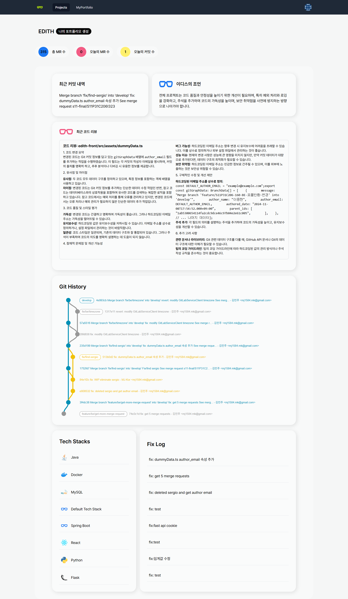
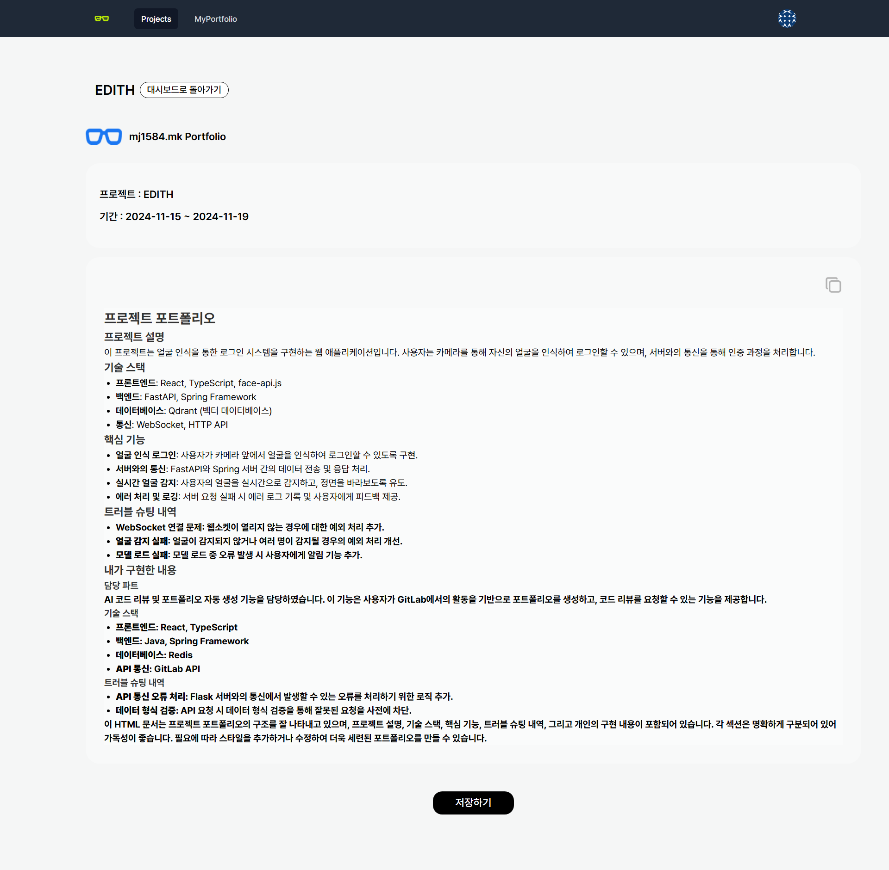

# 👓 E.D.I.T.H.

## 🗓️ 프로젝트 개요

### 진행 기간

- 2024.10.14 ~ 2024.11.19 (6주)

### 팀 구성

| 이상민 | 이중현 | 김민주 | 유재광 | 신민경 | 주현민 |
| :--------------------------------------------------------------: | :--------------------------------------------------------------: | :--------------------------------------------------------------: | :--------------------------------------------------------------: | :-------------------------------------------------------------: | :-------------------------------------------------------------: |
|  |  |  |  |  |  |
| Leader, BE | BE | Infra, BE | BE | FE | AI |

## 📢 서비스 소개

[📎 서비스 소개 UCC](https://youtube.com/shorts/xfRjP9bi9n4)

 **"E.D.I.T.H"** 는 개발자들이 GitLab을 활용한 협업 과정에서 발생하는 코드리뷰의 부담을 줄이고, 각 기여자가 무엇을 어떻게 기여했는지를 명확하게 정리해주는 포트폴리오를 자동으로 생성하는 것을 목표로 하고 있습니다. 또한 웹캠을 활용한 얼굴인식 기능을 통해 팀 내 작업자들이 비밀번호 없이 안전하게 로그인하고 프로젝트에 접근할 수 있게 합니다.

## 🥳 서비스 설계

### 기술 스택

|               | Front                                   | Back                                     | AI                       |
| ------------- | --------------------------------------- | ---------------------------------------- | ------------------------ |
| **Language**  |    JavaScript(ES6+), TypeScript        |            Java17                         |          python          |
| **IDE**       |       Visual Studio Code             |             IntelliJ                        |        Pycharm       |
| **Framework** |         React, Vite                   | Spring Boot | Pytorch, Tensorflow fastAPI, flask               |
| **Library**   | zustand, gitgraph, tailwind    ||  transformers, langchain, treesitter, openai |   

| DB           |               Infra              |     Monitoring       |        Tools         |
| :----------- |  :-----------------------------: | :------------------: | :------------------: |
| MySQL, Redis, Qdrant, ChromaDB | EKS, ECR, Jenkins, ArgoCD, Nginx, Docker, Mattermost |Grafana, Grafana-Loki, promtail| GitLab, Jira, Notion, MatterMost |

### ERD

### Wireframe

[📎 Figma Link](https://www.figma.com/design/gtZSlKBrvWnMwKEhw8YoFp/SSAFY%EC%9E%90%EC%9C%A8?node-id=0-1&t=otipj6NdPiacAX1B-1)

### Architecture

### Docs

[📎 API](https://gwenportfolio.notion.site/API-11fbdf75de3b81bab422d837e660b95a?pvs=4)  
[📎 기능 정의서](https://gwenportfolio.notion.site/11fbdf75de3b81a49411f0891770769c?pvs=4)

## 🤗 기능 소개

### 1. 메인 화면
- 회원가입, 로그인 제공
  - 이메일 로그인, 얼굴인식 로그인 선택
  

### 2. 회원 가입
- 이메일, 비밀번호, Git Personal Access Token 입력

### 3. 얼굴인식 로그인
- 얼굴인식 등록
  

- 얼굴인식 로그인
  

### 4. 사용자 화면 입장
- 사용자의 프로젝트, 사용자 당일 커밋 수, 사용자 당일 MR 요청 수 제공 
  

### 5. 프로젝트 등록
- GitLab repository의 project ID, 프로젝트 이름, 코드리뷰 대상 branch, 설명을 입력하여 진행중인 프로젝트를 등록

- 등록에 성공할 경우 해당 gitlab repository에 webhook 자동 생성
  

### 6. 코드리뷰
- 프로젝트를 진행하며 MR 등록을 했을 때, 일정 시간 후 AI 코드리뷰 등록

### 7. 프로젝트 대시보드 확인
- 프로젝트에 대한 전체적인 정보 제공

### 8. 개인 포트폴리오 생성
- 나의 포트폴리오 생성 버튼을 누를 경우 다음과 같은 AI 기반의 개인 맞춤형 포트폴리오 제공

## 🚩핵심 기능

### 1. RAG를 활용한 LLM 기반 자동 코드리뷰
- **기능 설명**:
  - **GitLab 커밋 감지**: GitLab API를 통해 새 커밋이 (웹 훅으로 감지)발생할 때마다 LLM이 해당 커밋의 코드를 자동으로 분석합니다. 커밋 메시지와 함께 변경된 파일 목록을 확인하고, 변경된 코드에 대한 리뷰를 생성합니다.
  - **RAG 활용**: 프로젝트 전체 코드를 메소드 별로 chunking 하고, CodeGraphBert 모델로 임베딩하여 vector DB에 저장합니다. LLM은 vector 형태로 저장된 코드를 리뷰 대상 코드와의 연관성을 판단하는데 사용합니다.
  - **LLM 분석**: 코드 스타일, 오류 가능성, 성능 개선 가능성 등을 분석하는 AI 모델을 사용하여 리뷰를 생성합니다. 예를 들어, 잘못된 변수명, 불필요한 복잡성, 성능 저하 가능성 등이 감지되면 자동으로 수정 제안을 포함한 리뷰를 작성합니다.
  - **코드 리뷰 생성**: LLM은 커밋된 코드를 분석한 후 해당 코드에 대해 개선 사항이나 권장 사항을 작성합니다. 리뷰 내용은 변경된 코드 블록과 함께 표시되어, 코드 리뷰가 명확하게 이루어질 수 있도록 지원합니다.

### 2. 포트폴리오 생성
- **기능 설명**:
    - **자동 분석**: 각 커밋에 대한 코드 리뷰 기록을 바탕으로, 기여자가 프로젝트에 어떤 영향을 미쳤는지를 자동으로 분석합니다. 트러블슈팅, 추가된 기능, 코드 개선 사항 등을 정리하여 포트폴리오를 구성합니다.
    - **트러블슈팅 기록**: 기여자가 해결한 문제에 대한 로그를 자동으로 추적하고, 이를 상세하게 기록하여 포트폴리오의 문제 해결 섹션에 포함시킵니다.
    - **핵심 기능 분석**: 기여자가 프로젝트에서 개발한 주요 기능을 식별하여, 포트폴리오에 해당 기여자가 맡은 기능과 성과를 명확하게 표시합니다.
    - **기여자별 분류**: 각 기여자가 담당한 코드와 모듈을 분류하고, 팀 프로젝트에서의 기여도와 역할을 정리하여 포트폴리오에 반영합니다.
- **포트폴리오 구성 요소**:
    - **트러블슈팅 기록**: 프로젝트 중 발생한 문제점과 그 해결 과정.
    - **핵심 기능**: 기여자가 개발한 주요 기능 및 기여한 코드 영역.
    - **기여자별 담당 기능**: 프로젝트에서 각 기여자가 담당한 모듈, 기능 등을 분류하여 정리.

### 3. 얼굴 인식 로그인

- **보안**: 얼굴 인식 데이터는 안전하게 처리되고 저장됩니다. 실시간으로 인식을 수행하여 편리하면서도 보안성이 높은 환경을 제공합니다.
얼굴 벡터 데이터는 Qdrant를 활용해 유사도를 계산하고, Anti-Spoofing 기술을 적용하여 보안성을 강화했습니다.

- **기능 설명**: 웹캠을 이용한 얼굴 인식 시스템을 통해 사용자들이 비밀번호 없이 안전하게 프로젝트 시스템에 로그인/로그아웃 할 수 있습니다.
  - 얼굴 데이터 전처리
  사용자가 입력한 얼굴 이미지를 클라이언트(React)에서 전처리 후, 벡터 데이터로 변환.
  변환된 벡터 데이터만 서버로 전송하여 개인 데이터를 보호.
  - Anti-Spoofing 기술 적용
  사용자가 업로드한 얼굴 이미지를 분석해 실제 사용자와의 일치 여부를 판단.
  사진이나 동영상 등으로 로그인 시도를 방지하여 보안 강화.
  - 벡터 데이터 비교 (Qdrant 사용)
  Qdrant의 벡터 데이터베이스를 사용하여 사용자의 얼굴 벡터와 기존 데이터 간 유사도를 계산.
  유클리드 거리 계산(Euclidean Distance) 알고리즘을 사용하여 벡터 간의 거리를 측정하고, 사전 정의된 임계값을 기준으로 인증 여부 결정.
