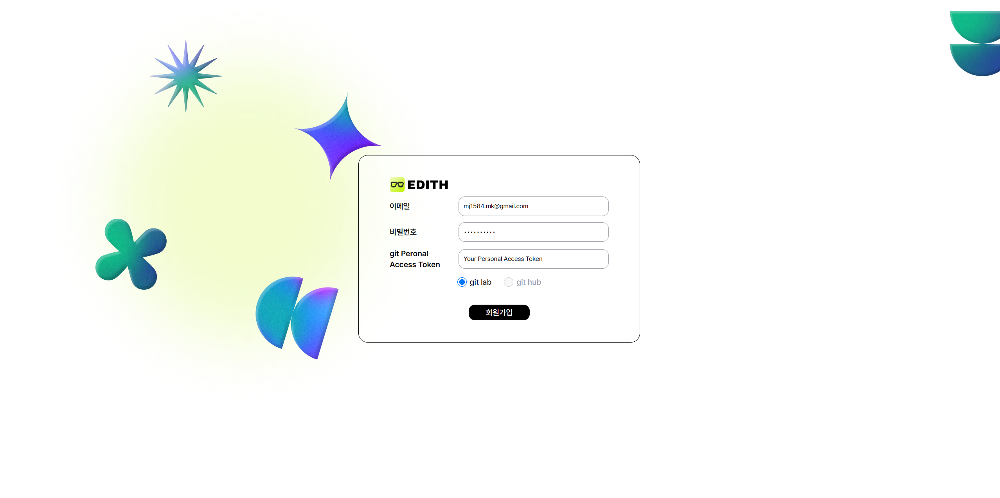
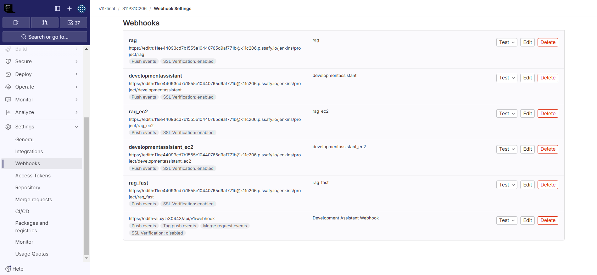
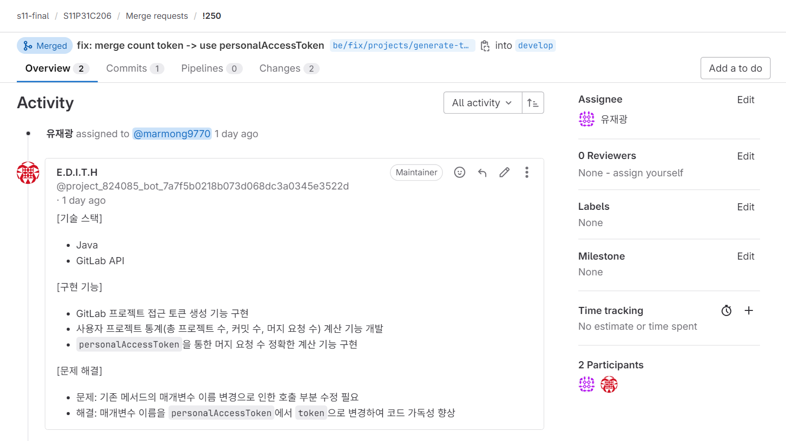
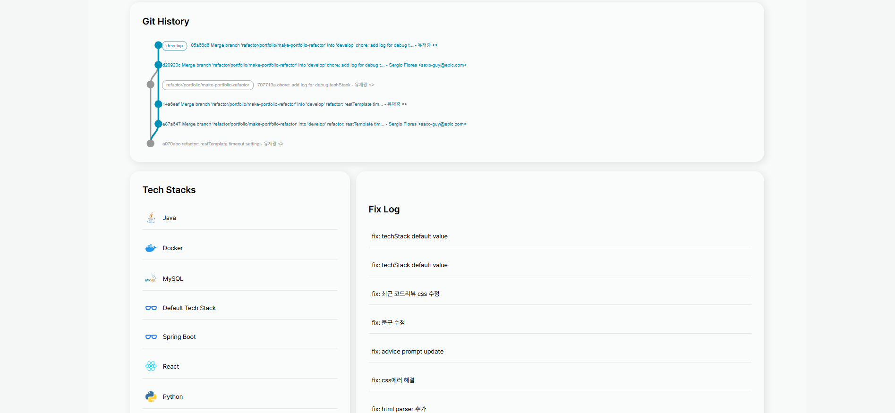

# EDITH 시연 시나리오

### 1. 메인 화면
- 회원가입, 로그인 제공
  - 이메일 로그인, 얼굴인식 로그인 선택
  

### 2. 회원 가입
- 이메일, 비밀번호, Git Personal Access Token 입력

### 3. 얼굴인식 로그인
- 얼굴인식 등록
  

- 얼굴인식 로그인
  

### 4. 사용자 화면 입장
- 사용자의 프로젝트, 사용자 당일 커밋 수, 사용자 당일 MR 요청 수 제공 
  

### 5. 프로젝트 등록
- GitLab repository의 project ID, 프로젝트 이름, 코드리뷰 대상 branch, 설명을 입력하여 진행중인 프로젝트를 등록

- 등록에 성공할 경우 해당 gitlab repository에 webhook 자동 생성
  

### 6. 코드리뷰
- 프로젝트를 진행하며 MR 등록을 했을 때, 일정 시간 후 AI 코드리뷰 등록

### 7. 프로젝트 대시보드 확인
- 프로젝트에 대한 전체적인 정보 제공

### 8. 개인 포트폴리오 생성

